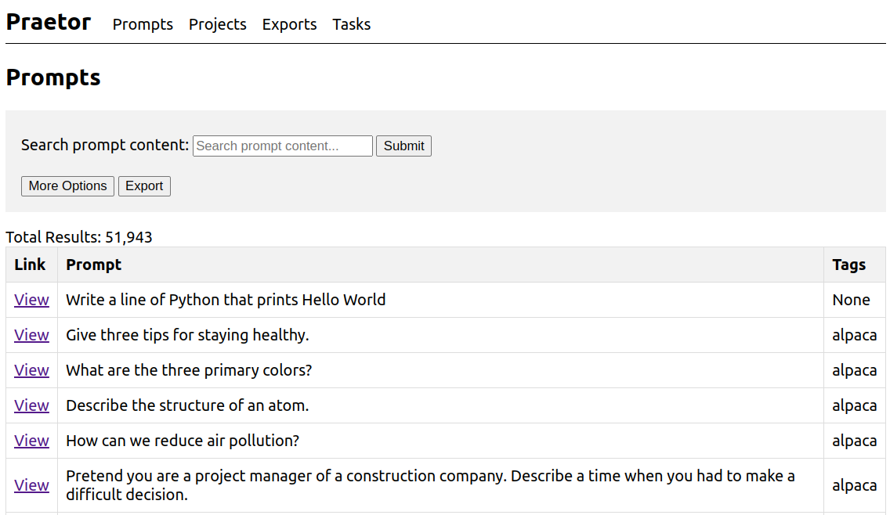
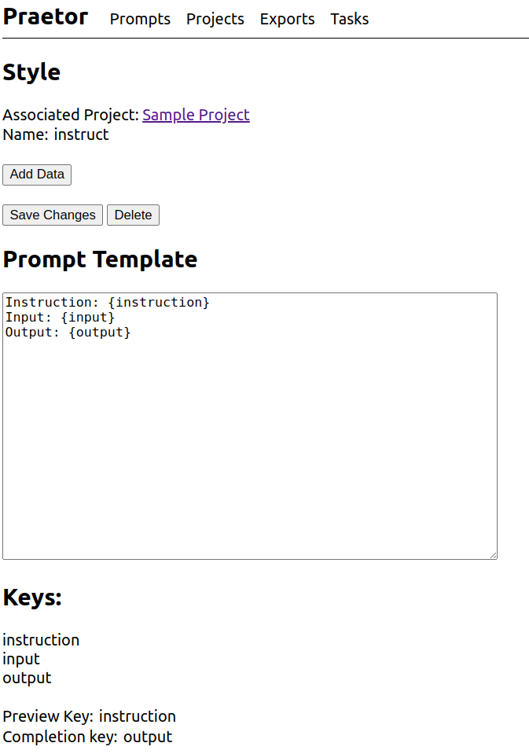

# Praetor

Praetor is a dataset exploration tool. It is made for LLM finetuning data and prompts.



---



## Why

I got sick of scanning through large json files to try and get a feeling for a dataset. Then when I wanted to remove some data, I was using control F - this is obviously dumb. Praetor is a flask app that lets you mix, edit, view, and export datasets for LLMs. The only pip requirement is flask. To keep it simple, the frontend is very straightforward. It uses an sqlite database and jinja templating under the hood. You can import and export datasets in a json format, so it is very easy to use Praetor along with other tools and scripts you already have in place.

## About

Praetor is a super lightweight finetuning data and prompt management tool. The setup requirements are minimal, and so is the complexity.

In general, the system works like this: you start with a Project. A project has associated with it some prompt styles, which define format strings for the prompts. You can then add prompts in a particular style and then one or more completions to those prompts. When you're done editing prompts or completions, you can export that data in a json format. You can also import data in the same format.

Thus the hierarchy goes:

```
Projects --> Styles --> Prompts --> Completions
```

## Usage

First, it is recommended that you use a virtual environment if you do not already have one set up for your project. You'll need to install the requirements in any case (it's just Flask!):

```
python3 -m venv venv
source venv/bin/activate
pip install -r requirements.txt
```

Then you will need to initialize the database using

```
flask init-db
```

And then run the server:

```
flask run
```

## License

This software is distributed under a non-commercial license, but if you would like to use it in a commercial setting, just open an issue or shoot an email to gordon@agrippa.build and ask.

## Contributing

Everyone should feel free to open an issue if you have any comments, questions, or suggestions.

Pull requests should be submitted to the development branch. Please do not make additions to the requirements unless they are necessary. Frontend frameworks are not necessary. The frontend should be as simple and functional as possible.
